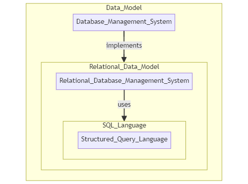

# 1 背景
### 1.1.1 数据库管理系统（DBMS）
> 数据库管理系统（Database Management System，简称DBMS）是一种用于管理和组织数据的软件系统。它提供了一组工具和机制，
> 使得用户和应用程序可以方便地存储、检索、更新和管理数据。DBMS 的发展旨在解决传统文件系统难以处理大规模数据和复杂数据关系
> 的问题。
> 
> *其实所有能够储存你所需数据的系统都可以称之为数据库，但是数据库管理系统是指一种能够提供数据管理服务的软件系统。* 

### 1.1.2 关系数据库管理系统（RDBMS）

> 关系数据库管理系统（Relational Database Management System，简称RDBMS），
> 是指采用了关系模型来组织数据的数据库，其以行和列的形式存储数据，以便于用户理解，关系型数据库这一系列的行和列被称为表，
> 一组表组成了数据库。用户通过查询来检索数据库中的数据，而查询是一个用于限定数据库中某些区域的执行代码。
> 关系模型可以简单理解为二维表格模型，而一个关系型数据库就是由二维表及其之间的关系组成的一个数据组织

### 1.1.3 结构化查询语言（SQL）
> 结构化查询语言（Structured Query Language，简称SQL）是一种专门用于管理和操作关系数据库的标准化语言。
> SQL提供了丰富的语法和功能，用于执行诸如查询、插入、更新和删除等数据库操作。
> RDBMS系统通过SQL语言实现了对数据的灵活和强大的操作，使得用户和开发者能够以简单而直观的方式与数据库进行交互。

---

----

### 1.2 映入B+树的目的
在RDBMS中，数据的高效存储和检索对系统性能至关重要。为了解决这一问题，B+树作为一种常用的索引结构在RDBMS中得到了广泛应用。
B+树的特点和优势使得它成为管理大规模数据的理想选择，通过其在查询、插入和删除等操作上的高效性能，能够满足RDBMS对于快速和可靠数据访问的需求。
RDBMS的应用涵盖了众多领域，包括企业管理、金融、电子商务等。在处理大量数据和复杂查询的场景下，B+树的优越性能使得其成为RDBMS中首选的索引结构之一。
本文将深入探讨B+树在RDBMS系统中的原理、应用和性能优化，为读者提供全面的了解和应用指导。

# 2 B树

## 2.2 详细解释参考连接
https://ivanzz1001.github.io/records/post/data-structure/2018/06/16/ds-bplustree